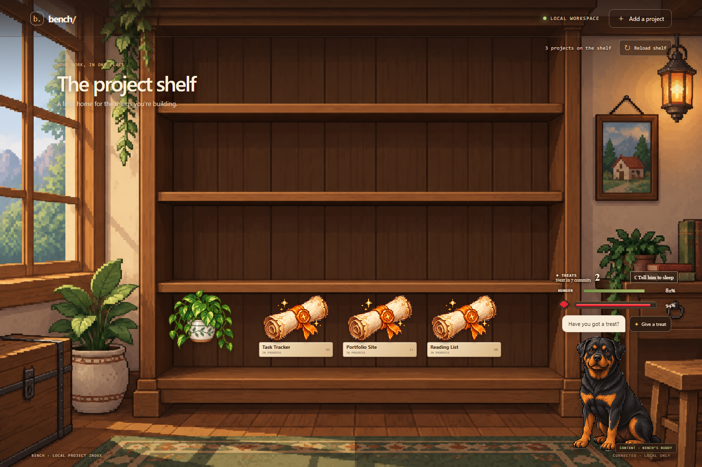
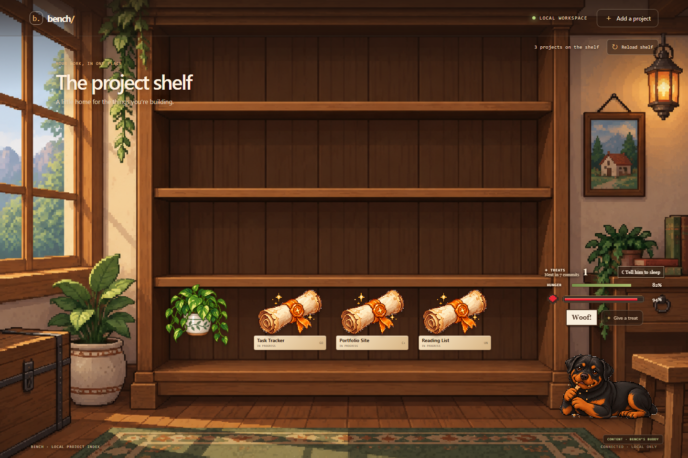

# Bench

Bench is a local-first dashboard for keeping development projects on one shelf. It scans folders you choose, records repository details in SQLite, and gives each project a status scroll. The app is being built as both a useful local tool and a small interactive pixel-art room: projects live on the shelf, a plant can be moved into place, and a Rottweiler companion reacts to project activity and treats.

## Screenshots

The shelf shows the saved projects, their status, the movable plant, and the pet's treat and health HUD. Feeding switches through the illustrated chewing poses; those frames now have transparent backgrounds so the room shows through.

The project names in these screenshots are generic labels added for the captures.





## Current state

The Go server, local SQLite project index, initial discovery scan, and add-one-project flow are in place. Reloading the shelf reads saved records instead of rescanning every repository. Project scrolls show Git status and language, and their colors represent priority (red), in progress (orange), and done (green). Opening a scroll brings up a repository-scoped coding chat and a parchment-style side desk. Notes and visible chat history stay in the browser; the chat session identifier and project index stay in the local database.

The room also has a draggable plant, a dog fixed to the right side of the screen, petting and scroll-hover poses, sleep controls, a seven-commit treat counter, hunger and health timers, and four eating frames. The floating heart meter and transparent eating sprites match the pixel-art room. The desk's Desk, Changes, and Files views are currently a layout scaffold; wiring those views to live repository diffs and file browsing is still ahead. This is an active build, so the README tracks what works and what remains rather than presenting the unfinished parts as complete.

## How it is built

Bench keeps the backend deliberately small. The Go standard library serves the app and its HTTP API. The `internal/discovery` package inspects Git repositories, `internal/store` persists the project index in SQLite, and `internal/api` exposes the local endpoints. The frontend is plain HTML, CSS, and JavaScript served directly by Go; there is no separate frontend build step.

The local-first boundary is intentional: Bench binds to loopback by default, scans configured folders on startup, and only inspects a single requested path when adding a project. Project notes, chat transcripts, and the SQLite index are local data and are not part of this repository. The dog’s vitals live in browser storage. The repository contains the app code, pixel-art assets, and screenshot examples.

## Run

Install Go, then from this directory:

```powershell
go run ./cmd/bench -root "C:\path\to\projects"
```

To use the repository chat, install Codex CLI and sign in once with `codex login`. Bench starts Codex App Server locally for each chat turn and uses that existing Codex login; Bench does not need an OpenAI API key. The chat uses the account’s configured Codex model and limits file changes to the selected repository.

Open <http://127.0.0.1:7341> after Bench starts. The Go server serves the frontend from the web directory and the API from /api/; no separate frontend build is needed. Pass `-root` more than once to scan several folders. Bench does one full discovery scan when it starts, then keeps the project list in SQLite. Reloading the shelf only reads that saved list. When you add a project, Bench checks only that path and requires it to be inside one of the configured roots. Bench listens only on `127.0.0.1:7341` by default and stores its database under `.bench/` in the current directory. Use `-listen` or `-db` to change those settings.

## API

- `GET /api/health` — service health
- `GET /api/projects` — saved project list, notes, and current commit counts; no filesystem scan
- `POST /api/projects` — inspect and add one Git repository: `{"path":"C:\\path\\to\\repo"}`
- `PUT /api/projects/{id}/note` — save or clear a project note
- `POST /api/projects/{id}/chat` — stream a Codex response for the selected repository using server-sent events
- `GET /` — local project shelf

Project discovery reads Git metadata using read-only Git commands. It doesn’t change repositories or run their code. The server binds to loopback, and project paths and notes stay in the local SQLite database.

## Checks

```powershell
go test ./...
go vet ./...
```
